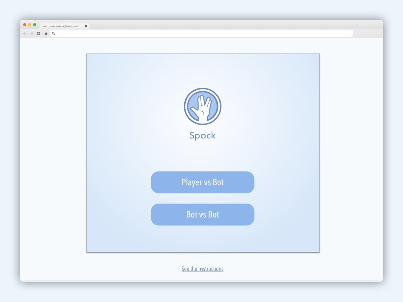
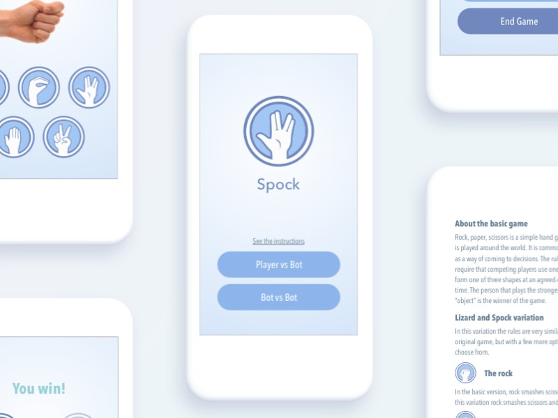

<a href="https://valkiriann.github.io/rock-paper-scissors-lizard-spock/">
    
</a>

# Rock, paper, scissors, lizard, spock

The classic rock, paper, scissors games including the variation of lizard and Spock.  
You can vs a bot or let the bots play alone!  

## The challenge

This project was a challenge with special rules to complete it:

- Can I play vs the computer? 
- Can the computer play vs the computer? 
- Can I switch between game modes each time?
- Use Javascript
- Libs / external modules should only be used for tests
- Use agile practices

## Getting Started

The project was made in HTML, CSS and JS. You can see a live previeww [here](https://valkiriann.github.io/rock-paper-scissors-lizard-spock/)
<p align="center">
    
</p>


### Prerequisites

This game was made for Chrome 68, but It was tested also in Safari 11.1.2 and in Firefox 62 with good compatibility and no issues. It is also compatible with the newer smartphones and tablets, it was tested in an Ipad Air 2, an Ipad pro, an Iphone 6 and a Xiaomi Mi A1, with no issues. However it is not compatible with browsers that don't support ECMASCRIPT 6 because the project uses string templates and some features that are not compatible with older versions.

## Design
<p align="center">
    
</p>

When I was thinking about my target, I imagined a range of 18 - 45 for the age. A casual gamer that likes to play on the phone when he/she has some spare time. I choose flat design for the main rule of the style.

I used a chromatic range of blues to inspire calm and relax. The object of the game is to just enjoy a simple mechanic when you want to disconnect a little from your daily rutine.

<p align="center">
    
</p>

## Running the tests

To run the testing that was made with mocha and chai simply go to [/test/testrunner.html](https://valkiriann.github.io/rock-paper-scissors-lizard-spock/test/testrunner.html)

## Performance and scalability

The code is fully documented, and the logic is simple. We have a few variables that controls the game:

```
let gameMode = 0
let round = 1
let p1Move = 0
let p2Move = 0
let result = ''
let resultCode = ''
let p1Score = 0
let p2Score = 0
```
Because I could not use any external libs, I created my own special render for the views, that basically takes the wrapper and changes the innerHTML with the template of the view that the user needs to see. I pass the template as a template string with ES6.

I also have introduced a view_helper object that contains functions to dynamically create the parts that repeat with a pattern to avoid repeting code and to be more efficient. I use this when I have to display the rules for ever move or when I have to display the icons of every move to show the user the posibilities of the round.

```
let view_helpers = {
    rulesGenerator: function() {
        let content = ''
        for(let i=0;i<movements.length;i++){
            content += `
            <section class="text-box">
                <div class="title-icon">
                    
                    <h3>The ${movements[i]}</h3>
                    <p>${descriptionStrings['M'+i]}</p>
                </div>
            </section>
            `
        }
        return content;
    },
    choiceGenerator: function() {
        let content = ''
        for(let i=0;i<movements.length;i++){
            content += `
            
            `
        }
        return content
    },
}

let views = {
    home: function() {
        return `
        <div class="flex-col">
            <div id="logo-container" flex-item">
                
                
                
                
                
            </div>
            <div class="title flex-item"><h1 id="logoTitle">Rock</h1></div>
            <div class="main-menu flex-item">
                <h3 data-gt="rules">See the instructions</h3>
                <button class="btn" data-gt="choice">Player vs Bot</button>
                <button class="btn" data-gt="botFight">Bot vs Bot</button>
            </div>
        </div>
        `
    },
    rules: function() {
        return `
        <div class="rulesView">
            <aside class="close" data-gt="home">
                
            </aside>
            <section class="text-box">
                <h3>About the basic game</h3>
                <p>Rock, paper, scissors is a simple hand game that is played around the world. It is commonly used as a way of coming to decisions. The rules require that competing players use one hand to form one of three shapes at an agreed-upon time. The person that plays the strongest “object” is the winner of the game. </p>
            </section>
            <section class="text-box">
                <h3>Lizard and Spock variation</h3>
                <p>In this variation the rules are very similar to the original game, but with a few more options to choose from.</p>
            </section>
            ${view_helpers.rulesGenerator()}
            <section class="text-box">
                <h3>Good luck and enjoy!</h3>
                <button class="btn btn-icon btn-trans" data-gt="home"> Back to home</button>
            </section>
        </div>
    `
    },
    choice: function() {
        return `
        <div class="flex-col">
            <section class="title-round flex-item">
                <h3>Round ${round}</h3>
                <h4 id="">Choose your move</h4>
            </section>
            <section class="hand flex-item">
                
            </section>
            <section class="move-menu flex-row flex-item">
                ${view_helpers.choiceGenerator()}
            </section>
        </div>
        `
    },
    results: function() {
        return `
        <div class="flex-col">
            <section class="title-result flex-item">
                <h2 class="${result}-title">${titleString[result+gameMode]}</h2>
            </section>
            <section class="results-icons flex-row flex-item">
                
                <p class="vs">- VS -</p>
                
            </section>
            <section class="result-msg flex-item">
                <p>${resultStrings[resultCode]}</p>
            </section>
            <section class="scoreboard flex-item">
                <div class="score-label" id="player1Label"><p>${players[gameMode]}</p></div>
                <div class="score"><span id="player1Score">${p1Score}</span><span> - </span><span id="player2Score">${p2Score}</span></div>
                <div class="score-label" id="player2Label"><p>${players[gameMode+1]}</p></div>
            </section>
            <div class="main-menu flex-item">
                <button class="btn" data-gt="next">Next round!</button>
                <button class="btn btn-trans" data-gt="home">End game</button>
            </div>
        </div>
        `
    }
}
```
If the view needs special javascript like the home view, to make animations or special effects, you can pass it as an optional parameter

```
function render(view, animation){
    let wrapper = document.getElementById('wrapper');
    wrapper.innerHTML = view
    if(animation){
        animation();
    }
}
```

All the structure of the project is ordered in objects to have a clean space for working and to make sure everything is scalable

```
let animations = {
    home: function(){
        var logoTitle = document.getElementById('logoTitle');
        var logos = document.getElementsByClassName('logo')
        logos[0].classList.add('active')
        var count = 0
        let logoInterval = self.setInterval(function () {
            if(document.body.contains(logoTitle)){
                if(count == (logos.length - 1)){
                    logos[logos.length - 1].classList.remove('active')
                    count = 0
                    logos[count].classList.add('active')
                    logoTitle.innerHTML = movements[count]
                }else {
                    logos[count].classList.remove('active')
                    logos[count+1].classList.add('active')
                    logoTitle.innerHTML = movements[count+1]
                    count++;
                }
            }else{
                window.clearInterval(logoInterval);
            }
            
        }, 800);
    },

}
```

To calculate the move of the cpu I use a random function that choose 1 of the five current movements

```
const movements = ['rock','paper','scissors','lizard','spock']

function botMove(){
    return Math.floor(Math.random() * movements.length);
}
```

The system that I used to calculate the winner is based in how I structured the information. We have the array of the movements, I used the index of every movement as an ID to represent them in the other variables that stores the data about them.

```
const movements = ['rock','paper','scissors','lizard','spock']

const winnings = {
    M0: [2,3],
    M1: [0,4],
    M2: [1,3],
    M3: [1,4],
    M4: [0,2]
}
```
In the winnings object, I have stored an array that contains the movements against which it wins. If in the future we would have to increase the movements adding another variation, I would not have to touch anything in the logic, just add the movements to the array, then add the property in the winnings object and correct the arrays with the new pairs of winnings

Then I also use this system to take the strings that I need to show the user the process of the round. And also I use it to store the values for the rules so everything gets done dynamically and it is easier to maintain.

```
const resultStrings = {
    R00: 'Poker face',
    R01: 'Paper covers rock!',
    R02: 'Rock smashes scissors!',
    R03: 'Rock smashes lizard!',
    R04: 'Spock vaporizes rocks',
    R11: 'I am paperless',
    R10: 'Paper covers rock!',
    R12: 'Scissors cut paper',
    R13: 'Lizard eats paper',
    R14: 'Paper disproves Spock',
    R22: 'Rock n Roll',
    R20: 'Rock smashes scissors!',
    R21: 'Scissors cut paper',
    R23: 'Scissors decapitates lizard',
    R24: 'Spock smashes scissors',
    R33: 'Lizarding',
    R30: 'Rock smashes lizard!',
    R31: 'Lizard eats paper',
    R32: 'Scissors decapitates lizard',
    R34: 'Lizard poisons Spock',
    R44: 'I dont know how to feel',
    R40: 'Spock vaporizes rocks',
    R41: 'Paper disproves Spock',
    R42: 'Spock smashes scissors',
    R43: 'Lizard poisons Spock'
}

const descriptionStrings = {
    M0: 'In the basic version, rock smashes scissors. In this variation rock smashes scissors and lizard.',
    M1: 'In the basic version, paper covers scissors. In this variation it also disproves Spock.',
    M2: 'In the basic version, scissors cuts paper. Now it also decapitates lizard.',
    M3: 'Lizard is a new gesture that belongs to the variation. Lizard eats paper and poisons Spock.',
    M4: 'Spock is the second gesture of the variation. Spock vaporizes rock and smashes scissors.'
}
```

To resolve a round, We just have to search for the move of the second player in the array of winnings of the first player for a win, check if they are the same for a tie, or the second player would have won.

```
function resolve(move1,move2) {
    p1Move = move1
    p2Move = move2;
    resultCode = "R" + p1Move.toString() + p2Move.toString();

    if(winnings["M" + move1].includes(move2)){
        p1Score ++;
        return 'win'
    }else if(move1 == move2) {
        return 'tie';
    }else {
        p2Score ++;
        return 'lose';
    }
}
```


